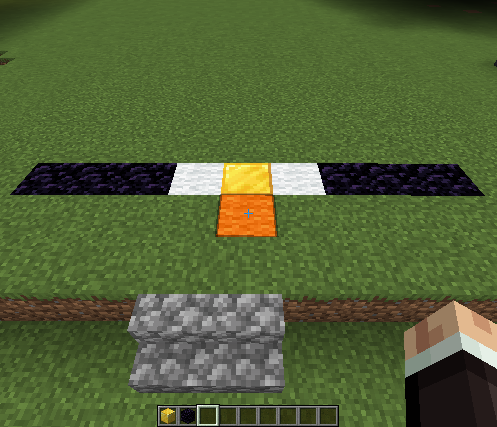
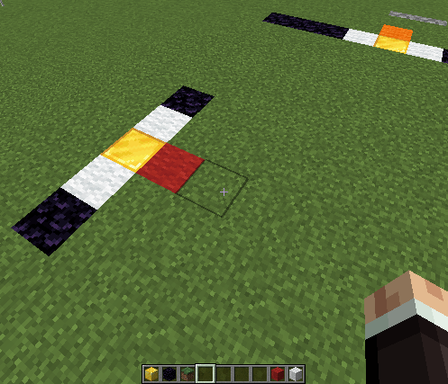
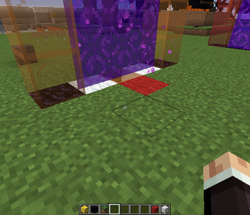

## What is PortalNetwork?

PortalNetwork is a portal system that gives control back to the players to be able to create portals that can dial each other. It supports different types of portals and allows players to change the portal shape.  Vehicles are also supported.

## Features

* Players can create up to 256 networks of portals with up to 16 portals in each network.  Any portal can dial any other portal in the same network.

* Three different looks of portals.  Nether, End Gateway and Hidden (Invisible) Portals

* Portals can exist on different worlds and can dial each other across worlds.

* Vehicles like Minecarts, Horses, Pigs and boats will teleport as well and maintain their passengers.

* Blocks other than Obsidian can be placed in the portal area. This allows rails to be placed for example.

* Portals only need a base to be built.  When they are dialled they will create their own frames if necessary and clean up after.

* Whatever enters one portal will maintain its relative orientation when existing another portal.  This includes existing the back of the portal when entering the front

* Relative velocity is also maintained. This means flying through with an elytra works well.

* If a portal has one side blocked (for example it is against a wall) then the player existing it will be flipped 180 to exit out the other side. If both sides are blocked then you have a naughty player.

* An API to allow plugins to add additional portal types.

## Quickstart

1. Get a `portalblock` using the command [`/pn give`](./permissions_and_commands/#give)

2. Place the `portalblock` down and put white wool on either side of it. This defines the *network* the portal belongs to; in this case white/white.

3. Place a third piece of wool on the side you wish to be the front. This defines the *address* of the portal within its network.  Altogether it should look like the shape of the T tetris block.

    !!! note "Portal Base"
        

4. Optionally place obsidian on either side of the *network* wool blocks to make the portal wider

    !!! note "Portal Base made wider"
        

5. Create another portal using steps 1-4 somewhere else. Make sure the `address` colour is different to your first portal.

    !!! note "Second Portal"
        

6. Right click anywhere on the base to dial the other portal and step through.  Note that the frame will turn the colour of the portal being dialled and the other portal will be dialled back.

    !!! note "Dialled Portal"
        

7. Right click again to dial the next colour. In this case as there is no next colour the portals will deactivate.
