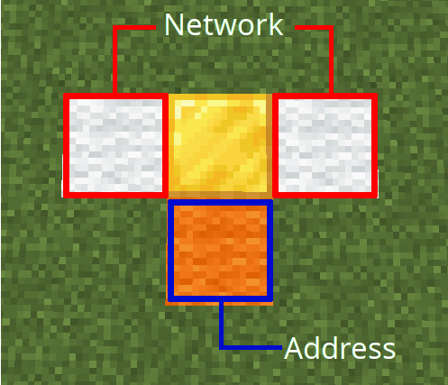
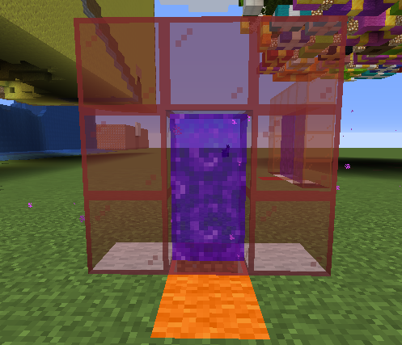
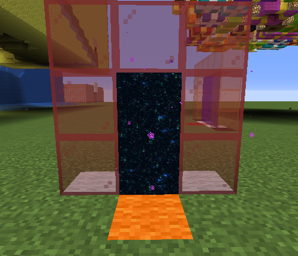
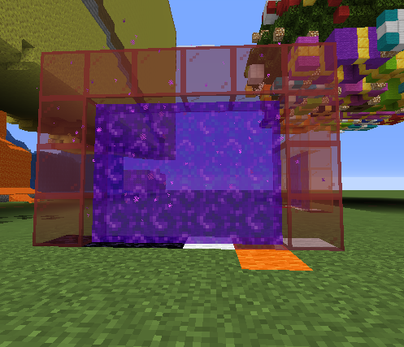
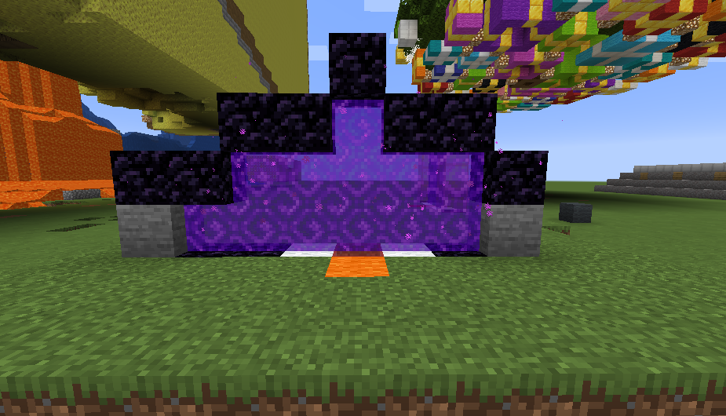

## Building a Portal

At a minimum a portal is built using just 4 blocks put together in the shape of a T shape Tetromino. A `portalblock` and 
3 coloured wool blocks. Right clicking any of these blocks will attempt to dial the next colour portal in the network.

### Network

The blocks to either side of the portal designate the *network* to which it belongs.  If you think of a phone number 
the *network* would be like an area code.  Any portal can dial any other portal that belongs to the same network.  As 
there are 16 colours this means that there is a total of 256 networks available.

### Address

The third coloured wool defines the portal *address*.  The address must be unique amongst all portals that belong
to the same *network*.  As there are 16 colours this means that you can have a total of 16 portals able to dial
each other per network.

!!! bug
    At the moment it is undefined what happens if 2 portals have the same address. This will be rectified shortly.

## Portal Types

The `portalblock` in the middle will define what type of portal will be generated.  This is purely cosmetic and any portal, 
regardless of its type, can connect to any other on the same network.

The three built-in portal types are:

  1. Nether
  2. End
  3. Hidden
  
### Nether

### End

### Hidden

## Portal Size

The size of the portal is determined by how wide it is.  You can make a portal wider by adding obsidian blocks to one
 or both sides of the network blocks.  The height is half the width + 2 blocks.  This includes the portal base and frame.

## Building in Portal

When a portal activates it will create a frame for itself of the colour of the remote portal address and will fill its
body with the type of portal being generated.

If any blocks are encountered in this area the portal will ignore them and generate itself around them.  This means that
any blocks placed in its frame will hide the frame and any blocks placed inside its body will not have a portal generated
(but will still trigger a teleport if it is passable).  It also means you can place blocks to hide the base layer of
the portal and place rails for a minecart.

The only block that has special meaning is an obsidian block. Any obsidian block found in the portal area will prevent
the portal generating any higher than just under that block and above that block will not trigger a teleport.  This
allows you to control the actual height of the portal.

Pressing sneak when placing a block on the base will not trigger a dial.

## Direction and Velocity

When a player steps through a portal they will exit the destination portal with the same relative direction and velocity
they entered.  This means if they enter through the front left of a portal they will exit at the back left of the
destination portal (relative to its direction).  Velocity it maintained so flying through on an elytra will exit at
the same height and velocity.

If a portal is blocked on one side, for example if it is built against a wall, then a player will always exit out of the unblocked
side no matter which side they entered the source portal.

If a vehicle enters the portal then it and all its passengers will be teleported to the destination portal, maintaining
relative direction and velocity.  Yes you can have minecart on a rail go between portals.

## Size Differences

Generally the player will exit out in the same relative position of the destination portal that they entered in the
source portal.

If the destination portal is shorter then they will be clipped to its height if entering too high in the source
portal.

Likewise if they are too far right or left in the source portal compared to the destination portal they will be
clipped to the corresponding side.

## Destinations

Portals can dial between worlds on the same server.  This allows a portal in the Nether to dial a portal in the overworld
or indeed any other custom work.

!!! info
    Multiserver bungeecord support will come in due course.

